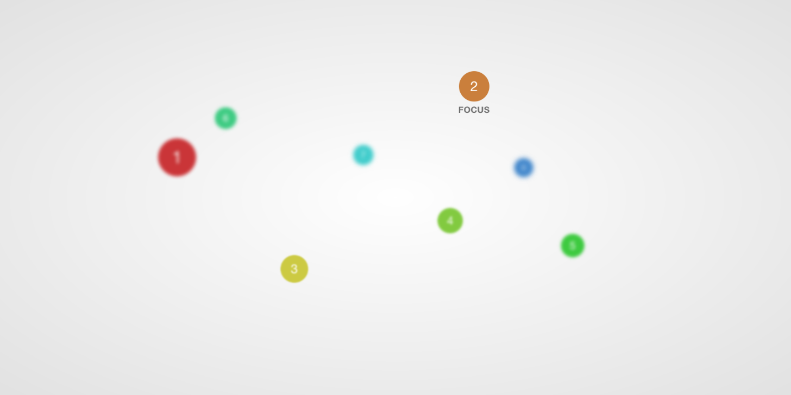

# jQuery Focal

Simulates a camera focus within a 3D CSS `transform` powered scene, by blurring layers (using CSS filters) according to proximity to the focal point (determined via `translateZ` values).

## Demo

Try out `demo.html` [via RawGit](http://rawgit.com/jaydenseric/Focal/master/demo.html).



## Browser support

- Chrome 18+
- Safari 6+
- Firefox 35+
- Opera 15+

Dependant on [CSS filter support](http://caniuse.com/#feat=css-filters), specifically `blur()`.

Works fine in Chrome and beautifully in Safari. Firefox won't support filters by default [until version 35](https://developer.mozilla.org/en-US/docs/Web/CSS/filter#Browser_compatibility). IE is a bummer as usual, although Microsoft says [it's on the way](https://status.modern.ie/filters).

## Usage

Refer to `demo.html` for a working example.

In the HTML, create a container and apply a CSS `perspective` in pixels.

Add scene layers to the container with varying CSS `transform` `translateZ` values. Scene layers must be child to the container as nested transforms are not yet supported.

If desired, set a transition for the blur on all layers:

```css
#container > * {
	transition: all 1s;
}
```

To set a container's focal point on a layer with the id `layer-1`:

```javascript
$('#container').focalPoint($('#layer-1'));
```

Again, setting the `maxBlur` option (the blurriest near and far layers may appear) a bit sharper than default:

```javascript
$('#layer').focalPoint($('#layer-1'), {
	maxBlur: 5
});
```
